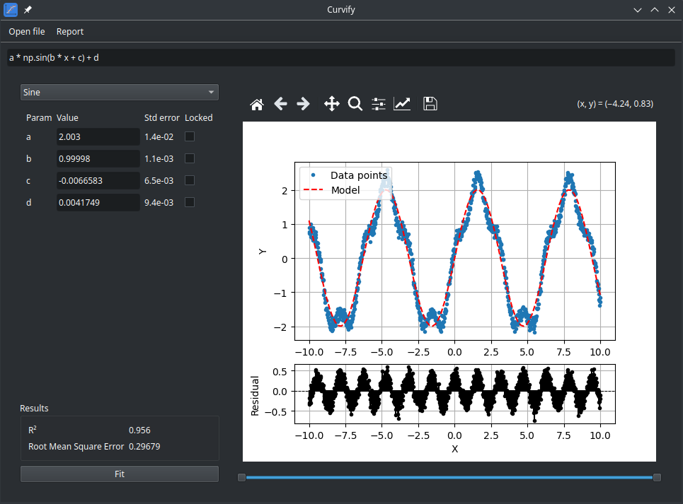
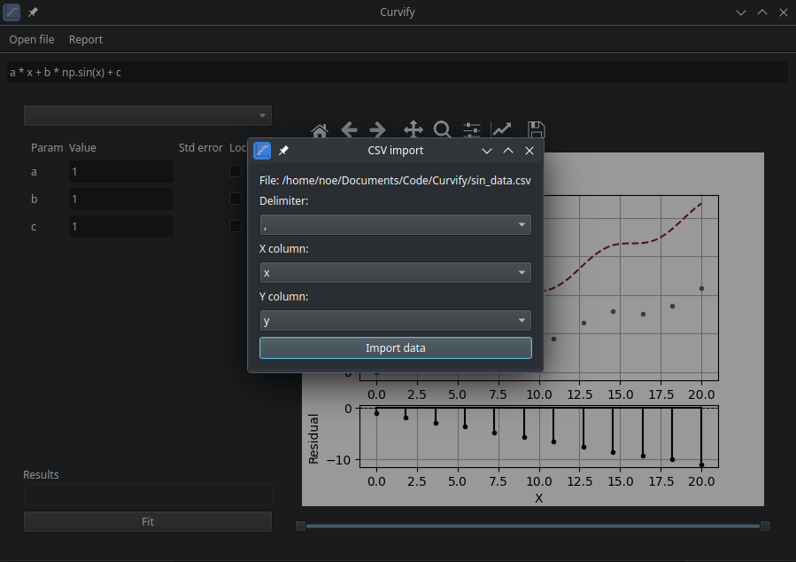

# Curvify

A curve-fitting library built on top of `scipy.curve_fit`, inspired by the MATLAB Curve Fitting Toolbox and curvefitgui.

## Features
- Drap-and-drop csv file
- Choose from pre-defined model templates
- Write custom models
- Set initial parameter values
- Fix specific parameters
- Generate and display a fitting report

## Installation
```bash
git clone git@github.com:NoePeterlongo/curvify.git
pip install ./curvify
```

## Usage

### Command Line
```bash
curvify
curvify --csv path_to_csv.csv
```

### Python Script
```python
from curvify import curvify
import numpy as np

x_data = np.linspace(0, 20, 12)
y_data = 0.5 * x_data + np.sin(x_data) + np.random.randn(len(x_data)) * 0.1
default_function = "a * x + b * np.sin(x) + c"

curvify(x_data, y_data, default_function)
```

## Notes
 - In models, parameter must be a single letter, followed by an optionnal number

## Screenshots



